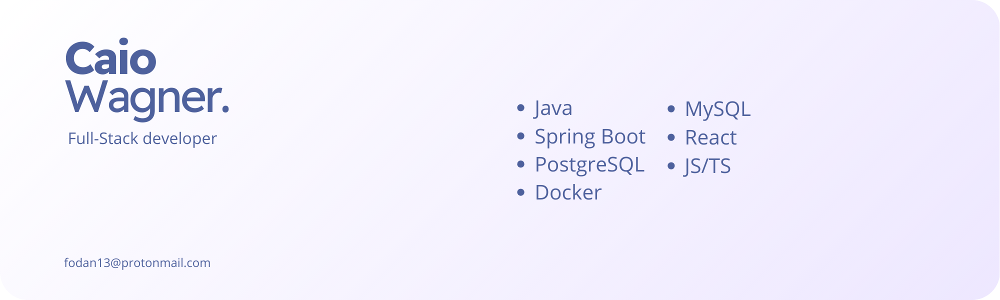

---

## Caio Wagner  
**Full-Stack Developer**  
Java · Spring Boot · React · PostgreSQL · Docker

I’m a full-stack developer with experience building scalable web solutions, focusing on clean architecture, performance, and code quality.  
I work across the entire development lifecycle — from system design to deployment — delivering efficient and maintainable products.

---

### ⚙️ Tech Stack  
- **Backend:** Java, Spring Boot, PostgreSQL, MySQL, Docker  
- **Frontend:** React, TypeScript, JavaScript  

---

### 📌 Featured Projects

- [🎓 System for Special Education Teachers](https://example.com)  
  A platform designed to assist special education professionals in managing individualized learning plans and student follow-up.

- [🔗 URL Shortener](https://github.com/Chi0x03/shorturl)  
  A lightweight URL shortening service with fast redirection and basic analytics.

---

### 📫 Contact  
**Email:** [fodan13@protonmail.com](mailto:fodan13@protonmail.com)
